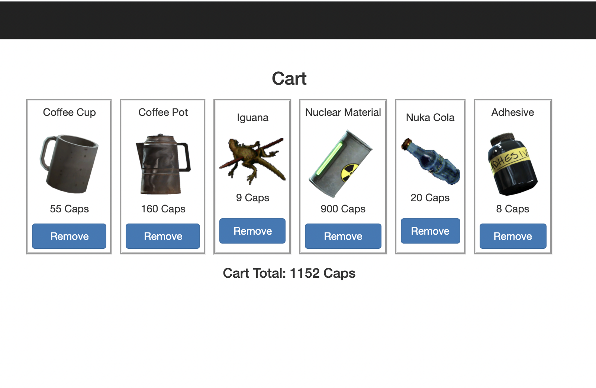

# ApocaMart: A Shopping Experience for the Apocalypse
This is a fullstack application to build out an online marketplace. This specific frontend takes the apocalyptic setting from the Fallout series and runs with it. While the theme of the marketplace can change, the backend API shopping cart structure can remain the same. 

The application is live at this [link](https://apocamart-frontend.herokuapp.com/).

Each product is tied to a category. A user can view the various categories and add items to their order/shopping cart. 

The shopping cart will update the total depending on which items are in the cart, or display a message if there are no items in the cart.

## Tech Used
- Java Spring Boot (backend)
- Angular (frontend)
- BootStrap
- [ngx-toastr](https://www.npmjs.com/package/ngx-toastr#individual-options) dependency for custom toast messages
- Heroku for online deployment of both front and back ends

## Endpoints
Request Type | Endpoint Address | Description
------------ | ---------------- | -----------
POST | auth/users/register | Registers a new User
POST | auth/users/login | Allows a user to log in
PUT | auth/users/reset | Allows a user to reset their password
PUT | auth/users/email | Allows a user to reset their email
GET | api/categories | Returns all categories
GET | api/categories/{categoryID} | Returns a single category based on the passed id
POST | api/categories | Creates a category if the account calling this endpoint has admin credentials
DELETE | api/categories/{categoryID} | Deletes a category if the account calling this endpoint has admin credentials
POST | api/orders | Creates a new order
GET | api/orders/open | Returns open order for the account calling this endpoint
POST | api/cart/{productId} | Adds an item to the cart
DELETE | api/cart/{prouctId} | Deletes an item from the cart
POST | api/{categoryId}/products | Creates a new item tied to a specific category
DELETE | api/products/{productId} | Deletes an item

## Major Milestones
1. Completing ERD for how the table structure will look on the backend
2. Creating user stories that dictate how the website should behave and respond
3. Translating the ERD plans into Spring Boot code and connecting everything together. Many to many relationships are a tricky thing to implement but luckily this was pretty straight forward. 
4. Getting the items to display for each category
5. Getting the page to dynamically update itself once an item was removed from the cart
6. Implementing the ngx-toastr dependency. One frustrating thing I noticed while demoing the application was its lack of alerting the user when an action was taking place. I looked into implementing toasts but was not satisfied with anything I created. After a bit of research, I discovered ngx-toastr and it was fairly straight-forward to implement into my project.

## Future Installments
1. Allowing users to close out their current orders and storing order history that they can view.
2. Getting an admin portal set up. The endpoints are there and working but it would be nice to finish up the frontend for that.
3. Implementing more features and styling to really make the website come to life, even in an apocalyptic setting. 
4. Create a wishlist feature that will allow users to share their wishlists with others.
5. Continuous bug fixes.

## Known Issues
- Order not being properly created for a brand new user.
- Categories should always be visible, whether a user is logged in or not. Will need to tweak the code so the "Add to Cart" button does not appear if there is no logged in user.

## Questions? Comments? Concerns?
Were you testing out the app for yourself and stumbled across a bug not listed above or have a burning question? Feel free to reach out to me directly at jenmjanik@gmail.com.
