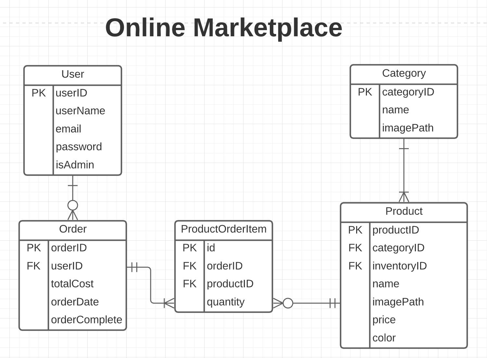

# Planning Phase

I decided to create an online marketplace with a shopping cart component that will track items in the cart as well as their price.

### User Stories
First and foremost, a **user** is someone who will be using the application to make a purchase. They are the buyers. The other type of person using the app is an **admin**, and admins have special endpoints available to them that allow them to create new categories and items.

- A user should be able to create an account
- A user should be able to log in
- A user should be able to start an order
- A user should be able to add items to an order
- A user should be able to delete an item from an order
- A user should be able to complete/submit an order
- A user should be able to view all categories
- A user should be able to view all items within each category
- An admin should be able to create an account
- An admin should be able to log in
- An admin should be able to create a new category
- An admin should be able to delete a category
- An admin should be able to create a new product
- An admin should be able to delete a product

### Models/Properties
**User**
- **PK** Long userID
- String userName
- String email
- String password
- boolean isAdmin

**Order**
- **PK** Long orderID
- **FK** Long userID
- Date orderDate
- boolean orderComplete

**ProductOrderItem**
- **PK** Long id
- **FK** Long orderID
- **FK** Long productID

**Product**
- **PK** Long productID
- **FK** Long categoryID
- **FK** Long inventoryID
- String name
- String imagePath
- Double price
- String color

**Category**
- **PK** Long categoryID
- String name
- String imagePath

### Relationships
- **User** to **Order**: One to Many
- **Order** to **Product**: Many to Many - this is achieved by the median **ProductOrderItem** entity, which connects the two
  - **Order** to **ProductOrderItem**: One to Many
  - **Product** to **ProductOrderItem**: One to Many

### ERD
  
